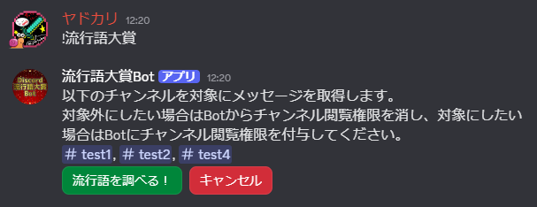
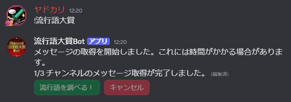
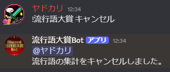
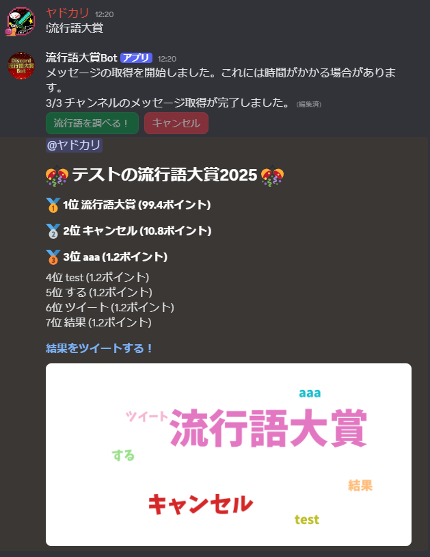

### Discordのメッセージをすべて集計し、今年の流行語大賞を算出するBotです。
### [招待リンクはこちら](https://discord.com/oauth2/authorize?client_id=1446472995404120074&permissions=101376&integration_type=0&scope=bot)
### [利用規約](./terms-of-service.md)
### [プライバシーポリシー](./privacy-policy.md)

# 使い方
1. [招待リンク](https://discord.com/oauth2/authorize?client_id=1446472995404120074&permissions=101376&integration_type=0&scope=bot)
から流行語を算出したいサーバーにBotを招待します。
2. `!流行語大賞` コマンドをBotの閲覧権限があるチャンネルで実行します。なお、実行には管理者権限が必要です。
3. Botから集計の対象となるチャンネル一覧が返信されます。  
  
集計対象外にしたいチャンネルが含まれていた場合、Botからそのチャンネルの閲覧権限を削除してください。  
集計対象にしたいチャンネルが含まれていなかった場合、Botにそのチャンネルの閲覧権限を付与してください。  
集計対象のチャンネルを再度確認したい場合は一度「キャンセル」ボタンを押し、もう一度 `!流行語大賞` コマンドの実行からやり直してください。
4. 集計対象のチャンネルが問題なかった場合、「流行語を調べる！」ボタンを押してください。流行語の集計が開始されます。このボタンはコマンドを実行した本人のみが押すことができます。それ以外の人が押しても反応しないため、注意してください。  
なお、取得するメッセージ数にもよりますが、1時間以上かかる場合もあります。集計中に送信されたメッセージに関しては、集計対象に含まれる場合と含まれない場合があります。  
集計中は `n/N チャンネルのメッセージ取得が完了しました。` というように進捗が表示されます。  
  
もし何らかの理由で途中でキャンセルしたい場合、`!流行語大賞 キャンセル` コマンドを実行してください。キャンセルされた場合、メッセージが送信されます。  

5. 集計に成功した場合、流行語の最大上位10単語と、単語を可視化した画像が返されます。ツイートリンクも送信されるため、もしよければツイートして共有してください。  
  
何らかのエラーが発生した場合、エラーIDが返されます。エラーIDとともに[開発者](https://x.com/Y4D0K4R1)に連絡してください。

# 注意事項
- メッセージに関する情報は流行語大賞の算出のみに使用し、メッセージに関する情報を保存したり、外部に送信したりすることはありません。
- メッセージ以外の情報は収集・保存する場合があります。具体的には以下の情報を収集・保存します。
  - DiscordサーバーID
  - コマンドが実行されたチャンネルID
  - コマンドを実行したユーザーID
  - 取得したメッセージ総数
  - コマンドを実行した時刻
  - 処理が終了した時刻
- 2年以上の期間で1つ以上のメッセージが送信されている必要があります。  
この条件を満たさない場合は「データが不足しているため流行語の算出ができませんでした。」というメッセージが返されます。
- 算出に成功した場合、実行後24時間は再実行ができなくなります。
  - 何度もエラーが発生したり、キャンセルした場合もしばらく再実行ができなくなります。

# 仕組み
TF-IDFというアルゴリズムによって算出しています。

[TF-IDFのWikipedia](https://ja.wikipedia.org/wiki/Tf%E2%80%93idf)

## 簡単に知りたい人向け
まず、流行語というのは「何度も使用され、流行った言葉」です。
そのため、他の単語に比べてより多く使用されている単語ということになります。

しかし、単に使われた回数が最も多いものをランキングにすると、「こんにちは」「ゲーム」「遊ぶ」といった、いつでも誰でも使うような一般的な単語が上位に来る可能性が非常に高いです。
これらは確かにたくさん使われていますが、「流行」しているかといわれるとそうではありません。  
そこで、「単語のレア度」を考えます。毎年使われているような単語はレア度が低く、今年だけ使われた単語はレア度が高いとします。

そして、その単語の使われた回数×レア度をその単語のポイントとし、そのポイントが高い順にランキングにすることで、今年だけたくさん使われた単語、つまり「流行語」が得られます。

## 詳細に知りたい人向け
TF-IDFの説明は省略します。

このBotでは、分析対象期間を1年間と設定します。この1年間をさらに「上半期」と「下半期」の2つの期間に区切り、それぞれの期間に送信された全メッセージを結合して、独立した文書 $d$ として扱います。
この文書 $d$ に対し、TF-IDFを用いて各文書に対して計算を行います。

期間を上半期と下半期で区切っている理由として、IDFの重みを下げるといった点が挙げられます。  
1年ごとに区切ってしまうと、例えば対象の期間が5年間(文書集合 $D'$ のサイズが $|D'|=5$ )であった場合、IDFの値は以下のように計算されます。  
```math
idf(t, D') = \log \frac{|D'|}{|d\in D':t\in d|} = \log \frac{5}{|d\in D':t\in d|} 
```
極端な例として、ある年の12月31日から使われだした単語と、翌年の1月1日から使われ始めた単語のIDFの値を考えます。なお、その他の条件は同じで、これら2年間にのみ出現したと仮定します。  
前者は $\log \frac{5}{2} \approx 0.9163$ 、後者は $\log \frac{5}{1} \approx 1.609$ となり、約1.75倍の差が生じます。
つまり、使われた回数(TF値)が同じであっても、使われ始めた日が一日違うだけで、最終的なTF-IDF値は後者のほうが1.75倍大きくなってしまいます。   
ここまで極端な例でなくても、年をまたいで流行った言葉は過小評価されてしまう可能性が高いです。  
その対策として、上半期と下半期で分割することで、IDFの過度な重みを抑制しています。
このような対策を取ることによって、同様の例であっても、対象期間5年間を10期間に分割した時の理論値を約1.43倍にまで抑えることができます。

そして各期間のTF-IDF値を計算したのち、上半期の値と下半期の値を合計し、その合計値をその年の単語の最終的なTF-IDF値として流行語を算出しています。

このような方法を取ることにより、TFの重みとIDFの重みのバランスを調整し、より実態に即した流行語が得られるようにしています。